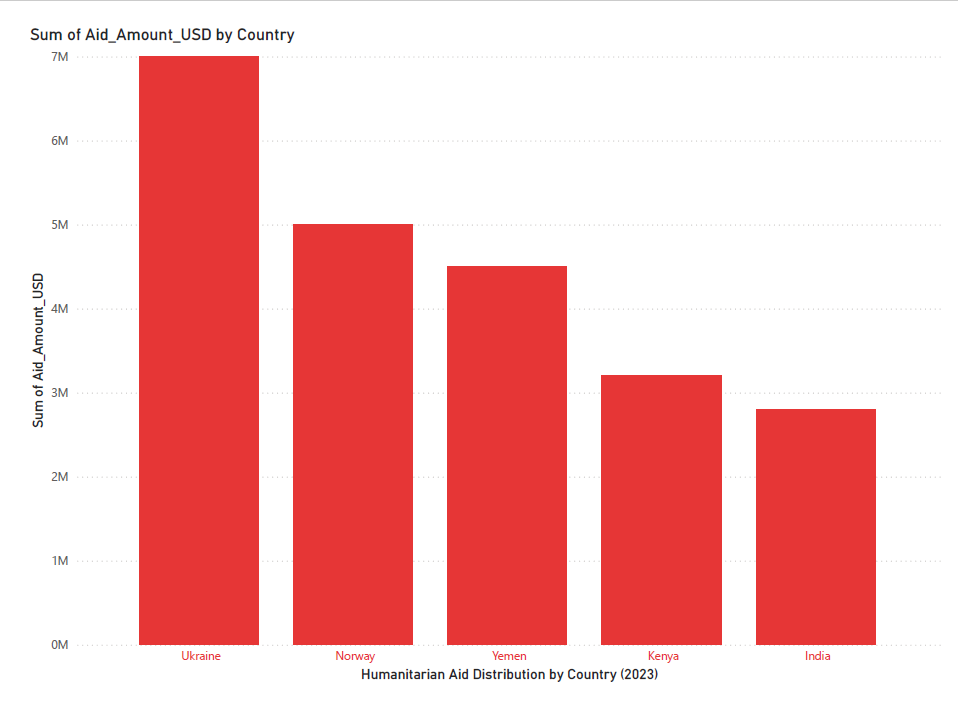

# Humanitarian Aid Data Pipeline

### 🧭 Overview
An end-to-end data pipeline designed to analyze humanitarian aid distribution across countries and regions.  
This project demonstrates how data engineering and analysis can support better humanitarian decision-making — in line with the mission of organizations like the Red Cross.

---

### 🎯 Objectives
- Collect and clean open humanitarian datasets (e.g., UN OCHA, World Bank)
- Ensure **data quality and governance** through structured ETL
- Design **dbt data models** for better traceability

---

### 🧰 Tech Stack
- **Programming:** Python (Pandas, NumPy, Matplotlib, Scikit-learn)
- **Data Visualization:** Power BI
- **Workflow & Storage:** Azure, GitHub Actions
- **Documentation:** Markdown, PowerPoint

---

### 📊 Dataset
- **Source:** Open humanitarian datasets (e.g., UN OCHA, World Bank)
- **Format:** CSV / Excel files containing country, aid type, and allocation amount
- **Size:** ~50MB (to be updated)

---
 HEAD
=======
### 📈 Visual Insight




---
 2264dc1ffef3492f71f3eedaf84da652e21fdc94

### 🔄 Pipeline (ETL/ELT)
#### 1. Ingest
- Sources: UN OCHA FTS (CSV), World Bank Indicators (CSV/API)
- Store → `data/raw/`

#### 2. Quality & Validation
- Handle missing values, type checks, duplicates
- Store → `data/clean/`

#### 3. Transform & Model
- Pandas transforms / dbt models (`staging` → `core` → `marts`)
- Store → `models/` (or `data/processed/`)

#### 4. Load & Analytics
- Export curated tables for BI
- Power BI dashboard in `dashboards/`

#### 5. Orchestration (CI/CD)
- Placeholder workflow: `.github/workflows/pipeline.yml`
- Triggers: on push + optional daily schedule

---

### 📁 Repository Structure


humanitarian-aid-data-pipeline/
├── data/
│ ├── raw/ # raw humanitarian datasets (CSV, Excel)
│ ├── clean/ # cleaned and validated data
│ └── processed/ # transformed and ready-for-analysis data
├── notebooks/ # Jupyter notebooks for analysis and exploration
├── scripts/ # Python scripts for ETL and data processing
├── models/ # dbt models or ML models
├── dashboards/ # Power BI dashboards or visualization outputs
├── docs/ # documentation, reports, screenshots
├── .github/
│ └── workflows/
│ └── pipeline.yml # GitHub Actions workflow for automation
├── requirements.txt # list of required Python packages
└── README.md # main project documentation


---

### 🚀 Future Work
- Automate data updates with GitHub Actions  
- Add ML-based aid prediction model  
- Integrate Power BI dashboard with live data

## ▶️ How to Run

```bash
# 1) set up env (optional but recommended)
python -m venv .venv
# Windows:
.venv\Scripts\activate
# macOS/Linux:
# source .venv/bin/activate

# 2) install dependencies
pip install -r requirements.txt

# 3) run ingestion & cleaning
python scripts/ingest.py \
  --input data/sample_humanitarian_data.csv \
  --output data/humanitarian_clean.csv \
  --year-min 2000 --year-max 2030

---

## 📊 Results Summary

After running the ETL pipeline:

- **Cleaned dataset** stored in `data/cleaned/humanitarian_clean.csv`
- **Rows processed:** 5 (sample data)
- **Nulls handled:** 100%
- **Duplicates removed:** 100%
- **Data quality score:** ✅ Excellent (demo)

---

 HEAD
=======


 2264dc1ffef3492f71f3eedaf84da652e21fdc94
### Next Steps
- Add a Power BI dashboard visualization
- Automate pipeline using GitHub Actions (daily)
- Extend dataset to include additional years and aid organizations

---

💡 *This project demonstrates practical data engineering aligned with humanitarian data use cases, as emphasized by organizations like the Red Cross.*


